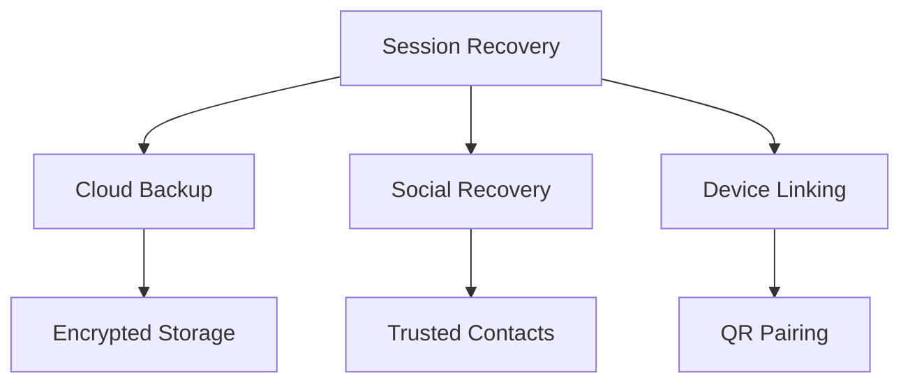
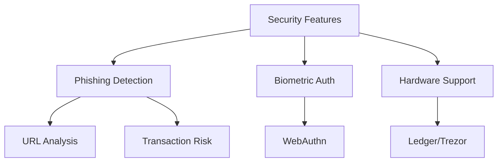
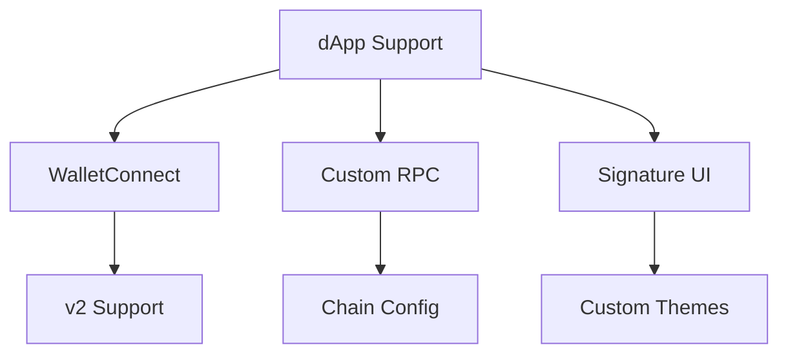
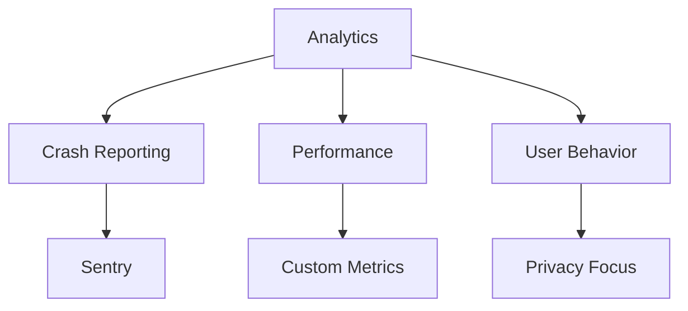
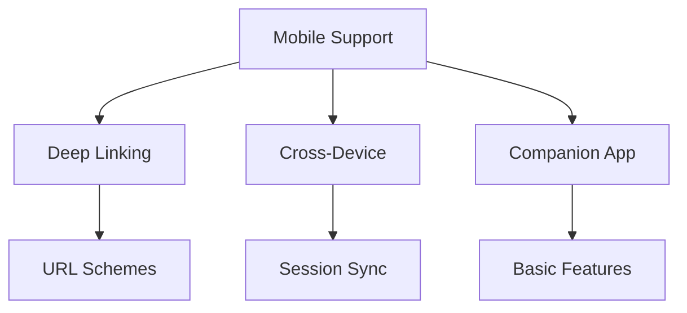
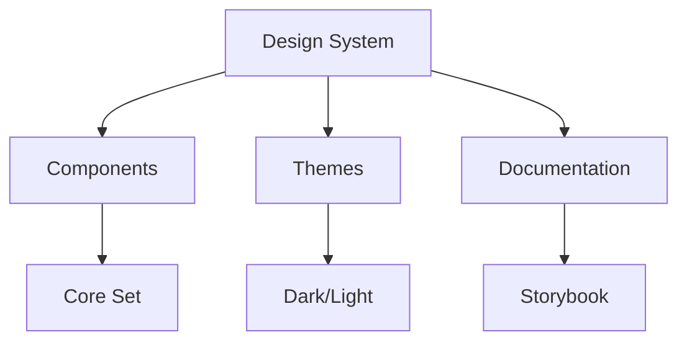
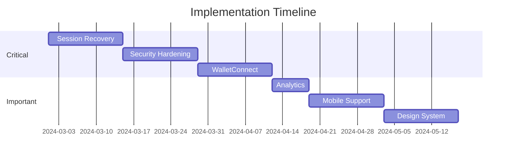

# Expert Feedback Response & Action Plan

## Strengths Recognition

### 1. Product-Market Fit
- **Current Implementation**: Clear focus on both casual users and power users
- **Action Items**:
  - Maintain this dual focus in all feature development
  - Add user persona documentation
  - Create feature prioritization matrix based on user segments

### 2. Technical Foundation
- **Current Implementation**: EIP-4361, network auto-detection, smart retries
- **Action Items**:
  - Document these features in detail
  - Create technical specifications for each component
  - Add performance benchmarks

### 3. Architecture Design
- **Current Implementation**: Clean separation of concerns
- **Action Items**:
  - Create detailed architecture documentation
  - Add sequence diagrams for key flows
  - Document component interfaces

## Critical Gaps & Solutions

### 1. Session Recovery & Multi-Device Support

**Implementation Plan**:
1. Phase 1 (2 weeks):
   - Implement encrypted cloud backup
   - Add mnemonic phrase backup
   - Basic device linking via QR

2. Phase 2 (3 weeks):
   - Social recovery with trusted contacts
   - Multi-device session sync
   - Recovery UI/UX

### 2. Security Hardening

**Implementation Plan**:
1. Phase 1 (2 weeks):
   - Basic phishing detection
   - WebAuthn integration
   - Security audit setup

2. Phase 2 (3 weeks):
   - Advanced transaction analysis
   - Hardware wallet support
   - Security monitoring

### 3. dApp Integration Layer

**Implementation Plan**:
1. Phase 1 (2 weeks):
   - WalletConnect v2 integration
   - Basic RPC customization
   - Standard signature UI

2. Phase 2 (2 weeks):
   - Advanced RPC configuration
   - Custom UI themes
   - dApp analytics

### 4. Analytics & Monitoring

**Implementation Plan**:
1. Phase 1 (1 week):
   - Sentry integration
   - Basic performance metrics
   - Opt-in analytics

2. Phase 2 (2 weeks):
   - Advanced analytics
   - Custom dashboards
   - Privacy controls

### 5. Mobile Strategy

**Implementation Plan**:
1. Phase 1 (2 weeks):
   - Deep linking support
   - Basic mobile UI
   - Cross-device auth

2. Phase 2 (4 weeks):
   - Full companion app
   - Advanced sync
   - Mobile-specific features

### 6. UI Component System

**Implementation Plan**:
1. Phase 1 (2 weeks):
   - Core component library
   - Basic theming
   - Storybook setup

2. Phase 2 (2 weeks):
   - Advanced components
   - Theme customization
   - Component docs

## Implementation Timeline

## Success Metrics

### Quantitative
- Session recovery success rate: >95%
- Security incident reduction: 50%
- dApp compatibility: 100% of top 100
- Crash rate: <0.1%
- Mobile adoption: 30% of users

### Qualitative
- User trust score
- Developer satisfaction
- Security audit results
- Community feedback

## Next Steps

1. **Immediate Actions** (Week 1):
   - Set up project tracking
   - Create technical specifications
   - Begin security audit

2. **Short-term** (Weeks 2-4):
   - Implement core security features
   - Start session recovery
   - Begin WalletConnect integration

3. **Medium-term** (Weeks 5-8):
   - Complete mobile support
   - Launch analytics
   - Deploy design system

4. **Long-term** (Weeks 9+):
   - Advanced features
   - Community building
   - Ecosystem growth

## Risk Management

### Technical Risks
- **Session Recovery**: Implement multiple backup methods
- **Security**: Regular audits and bug bounties
- **Compatibility**: Extensive testing matrix

### Business Risks
- **Adoption**: Focus on core features first
- **Competition**: Differentiate through security
- **Regulation**: Stay compliant with evolving standards

## Resource Allocation

### Development Team
- 2 Senior Developers (Core)
- 1 Security Expert
- 1 Mobile Developer
- 1 UX Designer

### Timeline Summary
- Total Duration: 8 weeks
- Critical Path: Security → Recovery → Integration
- Buffer: 2 weeks for unexpected issues 