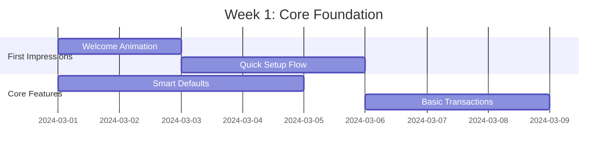
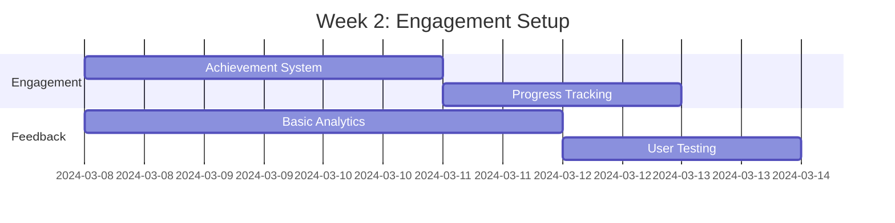
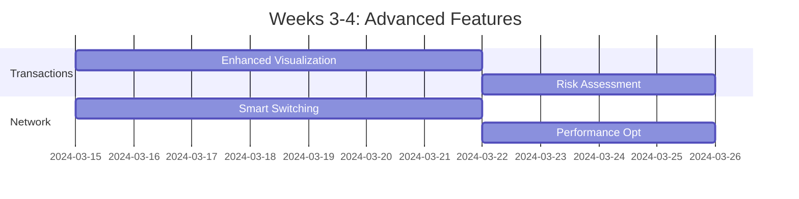
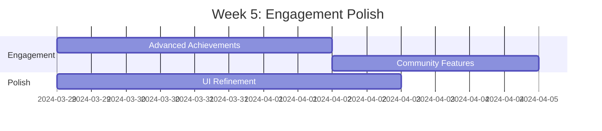
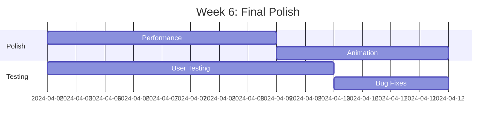
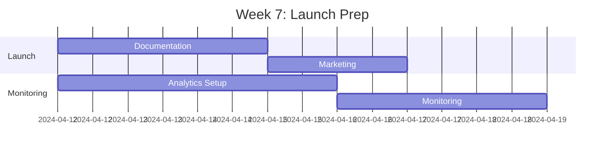
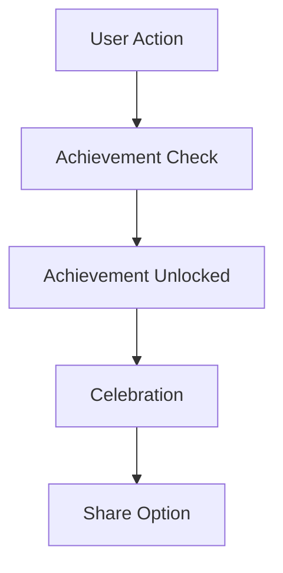
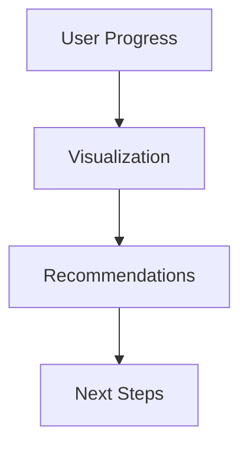
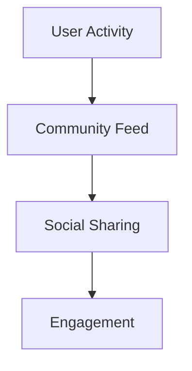

# FreoBus Extension - Implementation Strategy

## Phase 1: Foundation (2 weeks)

### Week 1: Core "Wow" Moments

#### Key Deliverables
1. **Welcome Experience**
   - Dynamic welcome animation
   - Personalized greeting based on user type
   - Quick-start options

2. **Smart Setup**
   - One-click wallet creation
   - Automatic network detection
   - Basic security configuration

3. **First Transaction**
   - Simplified transaction flow
   - Basic visualization
   - Success celebration

### Week 2: Engagement Foundation

#### Key Features
1. **Achievement System**
   - First transaction badge
   - Network mastery levels
   - Security milestones

2. **Progress Tracking**
   - Visual progress indicators
   - Milestone celebrations
   - Feature discovery prompts

## Phase 2: Enhancement (3 weeks)

### Week 3-4: Advanced Features

#### Implementation Focus
1. **Transaction Experience**
   - 3D visualization system
   - Risk assessment UI
   - Gas optimization

2. **Network Intelligence**
   - Predictive switching
   - Performance monitoring
   - Health dashboard

### Week 5: Engagement Enhancement

#### Key Features
1. **Advanced Engagement**
   - Community challenges
   - Leaderboard system
   - Social sharing

2. **UI Polish**
   - Micro-interactions
   - Animation refinement
   - Performance optimization

## Phase 3: Polish & Launch (2 weeks)

### Week 6: Final Polish

#### Focus Areas
1. **Performance**
   - Load time optimization
   - Animation performance
   - Memory management

2. **User Experience**
   - Final animation polish
   - Interaction refinement
   - Error handling

### Week 7: Launch Preparation

#### Key Activities
1. **Launch Preparation**
   - Documentation finalization
   - Marketing materials
   - Support preparation

2. **Monitoring Setup**
   - Analytics implementation
   - Performance monitoring
   - User feedback system

## Continuous Engagement Features

### 1. Achievement System

#### Implementation
- Daily challenges
- Milestone celebrations
- Community competitions

### 2. Progress Tracking

#### Features
- Visual progress indicators
- Personalized recommendations
- Feature discovery

### 3. Community Features

#### Implementation
- Activity sharing
- Community challenges
- Social integration

## Success Metrics

### Phase 1 Goals
- 50% reduction in setup time
- 80% first-time success rate
- 40% feature discovery rate

### Phase 2 Goals
- 75% reduction in transaction time
- 90% user satisfaction
- 60% community engagement

### Phase 3 Goals
- 95% first-time success rate
- 85% feature adoption
- 70% user retention

## Risk Management

### Technical Risks
- Performance impact of animations
- Network switching reliability
- Data synchronization issues

### Mitigation Strategies
- Progressive enhancement
- Fallback mechanisms
- Robust error handling

## Resource Allocation

### Development Team
- 2 Frontend Developers
- 1 Backend Developer
- 1 UX Designer
- 1 QA Engineer

### Timeline Summary
- Phase 1: 2 weeks
- Phase 2: 3 weeks
- Phase 3: 2 weeks
- Total: 7 weeks 