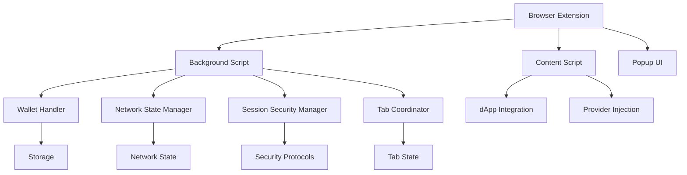
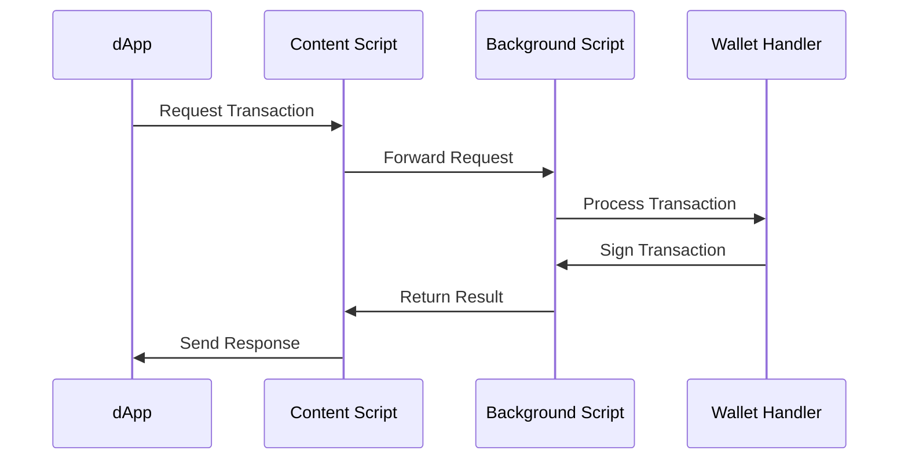
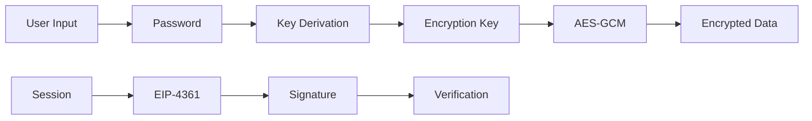

# FreoBus Extension - Project Overview

## Introduction
FreoBus Extension is a browser-based cryptocurrency wallet extension designed to provide a seamless and secure experience for both technical and non-technical users. The project focuses on two key aspects: creating a "Wow Effect" through user experience and implementing robust technical features for domain experts.

## Core Features

### 1. Smart Wallet Management
- **One-Click Setup**: Simplified wallet creation and initialization process
- **Multi-Account Support**: Manage multiple accounts with easy switching
- **Secure Storage**: Encrypted storage of private keys and sensitive data
- **Auto-Connect**: Smart session management with automatic reconnection

### 2. Network Management
- **Multi-Chain Support**: Native support for Ethereum and Polygon networks
- **Smart Network Detection**: Automatic network switching based on dApp requirements
- **Network State Tracking**: Real-time monitoring of network status and gas prices
- **Custom Network Support**: Ability to add and configure custom networks

### 3. Security Features
- **Session Security**: EIP-4361 compliant authentication
- **Connection Retry**: Smart retry mechanism with exponential backoff
- **Transaction Validation**: Comprehensive validation of transaction parameters
- **Permission Management**: Granular control over dApp permissions

### 4. User Experience
- **Intuitive Interface**: Clean and modern UI design
- **Transaction Flow**: Simplified transaction signing process
- **Error Handling**: User-friendly error messages and recovery options
- **Multi-Tab Support**: Seamless experience across multiple browser tabs

## Technical Architecture

### 1. System Architecture


### 2. Communication Flow


### 3. Security Implementation


## Current Achievements

### 1. Core Infrastructure
- ✅ Basic wallet creation and management
- ✅ Multi-network support (Ethereum, Polygon)
- ✅ Secure storage implementation
- ✅ Session management system

### 2. Security Features
- ✅ EIP-4361 authentication
- ✅ Transaction validation
- ✅ Permission management
- ✅ Connection retry mechanism

### 3. User Experience
- ✅ Network auto-detection
- ✅ Multi-tab coordination
- ✅ Error handling system
- ✅ Basic UI implementation

### 4. Testing Infrastructure
- ✅ Unit test setup with Vitest
- ✅ Test coverage reporting
- ✅ Network state testing
- ✅ Security component testing

## Future Roadmap

### 1. Planned Features
- [ ] Advanced transaction analytics
- [ ] Gas price optimization
- [ ] NFT support
- [ ] DeFi integration

### 2. Technical Improvements
- [ ] Performance optimization
- [ ] Enhanced error recovery
- [ ] Advanced security features
- [ ] Extended network support

### 3. User Experience Enhancements
- [ ] Customizable UI themes
- [ ] Advanced transaction history
- [ ] Portfolio tracking
- [ ] Mobile companion app

## Getting Started

### Prerequisites
- Node.js (v14 or higher)
- npm or yarn
- Modern browser (Chrome, Firefox, or Edge)
- Git

### Detailed Installation Steps

1. **Clone the Repository**
```bash
git clone https://github.com/your-org/freobus-extension.git
cd freobus-extension
```

2. **Install Dependencies**
```bash
# Using npm
npm install

# Or using yarn
yarn install
```

3. **Environment Setup**
```bash
# Create a .env file
cp .env.example .env

# Edit .env with your configuration
# Required environment variables:
# - INFURA_API_KEY
# - ALCHEMY_API_KEY
# - WALLET_ENCRYPTION_KEY
```

4. **Build the Extension**
```bash
# Development build
npm run build:dev

# Production build
npm run build:prod
```

5. **Load the Extension**
- Open Chrome/Edge: `chrome://extensions/`
- Enable "Developer mode"
- Click "Load unpacked"
- Select the `dist` directory

### Development Workflow

1. **Start Development Server**
```bash
npm run dev
```

2. **Run Tests**
```bash
# Run all tests
npm test

# Run tests with coverage
npm run test:coverage

# Run specific test file
npm test -- src/utils/NetworkStateManager.test.ts
```

3. **Code Quality**
```bash
# Lint code
npm run lint

# Format code
npm run format

# Type checking
npm run typecheck
```

4. **Debugging**
- Use Chrome DevTools for background script debugging
- Use browser console for content script debugging
- Check extension logs in `chrome://extensions/`

### Common Issues and Solutions

1. **Extension Not Loading**
- Clear browser cache
- Check console for errors
- Verify manifest.json configuration

2. **Network Connection Issues**
- Verify API keys in .env
- Check network permissions in manifest
- Ensure proper CORS configuration

3. **Build Errors**
- Clear node_modules and reinstall
- Check Node.js version compatibility
- Verify TypeScript configuration

## Contributing
We welcome contributions! Please read our [Contributing Guidelines](CONTRIBUTING.md) for details on our code of conduct and the process for submitting pull requests.

## License
This project is licensed under the MIT License - see the [LICENSE](LICENSE) file for details. 