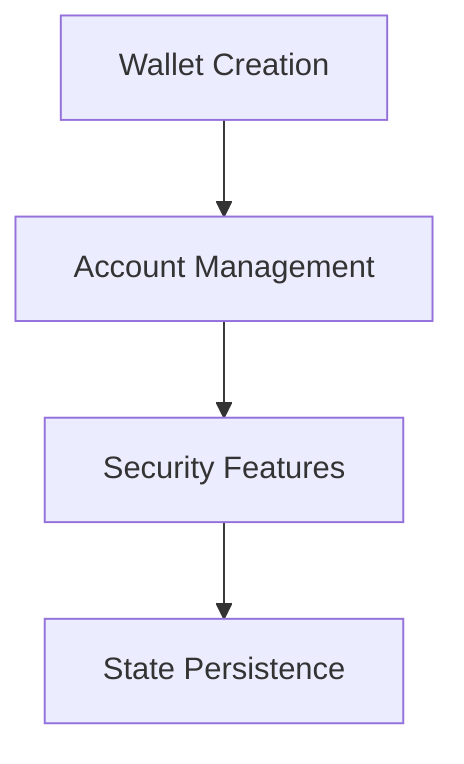
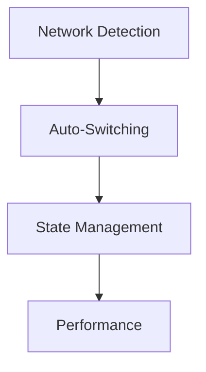
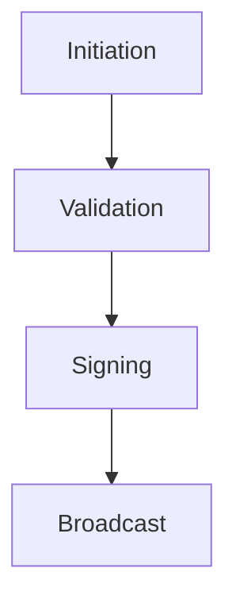
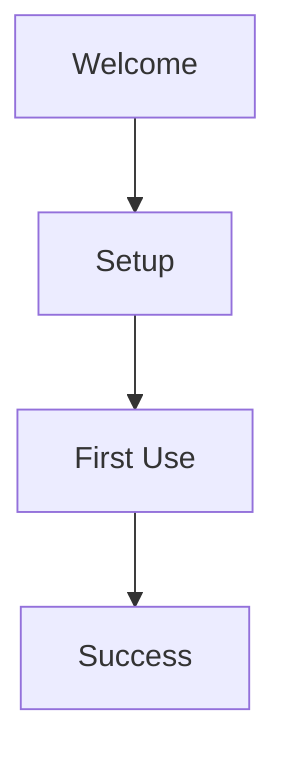
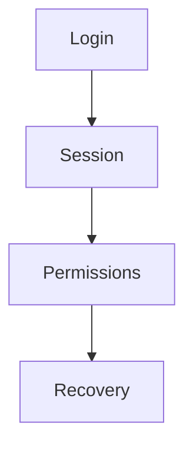
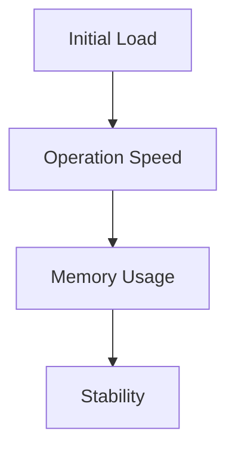
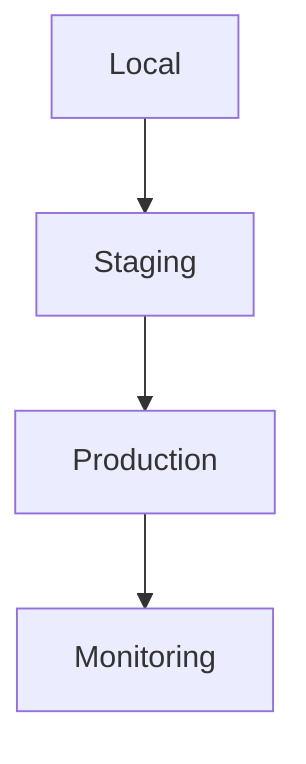

# FreoBus Extension - Testing Strategy

## 1. Core Feature Testing

### Wallet Management

#### Test Cases
1. **Wallet Creation**
   - One-click setup success rate
   - Password strength validation
   - Recovery phrase generation
   - Initial account creation

2. **Account Management**
   - Multi-account creation
   - Account switching
   - Account naming
   - Balance updates

3. **Security**
   - Encryption/decryption
   - Session management
   - Permission handling
   - Auto-lock functionality

### Network Management

#### Test Cases
1. **Network Detection**
   - dApp network recognition
   - Network suggestion accuracy
   - Fallback mechanisms
   - Error handling

2. **Auto-Switching**
   - Switch trigger conditions
   - Switch completion time
   - State consistency
   - User notification

3. **Performance**
   - Network response time
   - Gas price updates
   - Block number tracking
   - Connection stability

## 2. Transaction Testing

### Transaction Flow

#### Test Cases
1. **Transaction Initiation**
   - Parameter validation
   - Gas estimation
   - Network compatibility
   - Error prevention

2. **Signing Process**
   - Signature generation
   - Security checks
   - User confirmation
   - Error recovery

3. **Broadcast**
   - Transaction submission
   - Status tracking
   - Confirmation handling
   - Error reporting

## 3. User Experience Testing

### Onboarding Flow

#### Test Cases
1. **Welcome Experience**
   - Animation performance
   - Loading times
   - Responsiveness
   - Error states

2. **Setup Process**
   - Step completion
   - Progress tracking
   - Error recovery
   - User guidance

3. **First Transaction**
   - Flow completion
   - Success celebration
   - Error handling
   - User feedback

## 4. Security Testing

### Authentication

#### Test Cases
1. **Authentication**
   - Password validation
   - Session creation
   - Auto-lock triggers
   - Recovery process

2. **Permissions**
   - dApp access control
   - Transaction limits
   - Network restrictions
   - Security prompts

## 5. Performance Testing

### Load Testing

#### Test Cases
1. **Initial Performance**
   - Extension load time
   - Resource usage
   - Memory footprint
   - CPU utilization

2. **Operation Performance**
   - Transaction speed
   - Network switching
   - State updates
   - UI responsiveness

## 6. Testing Environment

### Setup

#### Environments
1. **Local Development**
   - Browser: Chrome, Firefox, Edge
   - Node versions: 14.x, 16.x
   - OS: Windows, macOS, Linux

2. **Staging**
   - Simulated production
   - Test networks
   - Mock services
   - Performance monitoring

3. **Production**
   - Real networks
   - Live services
   - User analytics
   - Error tracking

## 7. Testing Tools

### Required Tools
- Vitest for unit testing
- Playwright for UI testing
- Jest for component testing
- Chrome DevTools for debugging
- Network throttling tools
- Performance monitoring

## 8. Success Criteria

### Quantitative Metrics
- 100% test coverage for core features
- < 100ms response time for UI
- < 1s transaction initiation
- 0 critical security vulnerabilities

### Qualitative Metrics
- Smooth user experience
- Clear error messages
- Intuitive recovery flows
- Consistent performance

## 9. Testing Schedule

### Phase 1: Core Features (Week 1-2)
- [ ] Wallet management
- [ ] Basic transactions
- [ ] Network detection

### Phase 2: Advanced Features (Week 3-4)
- [ ] Enhanced transactions
- [ ] Network switching
- [ ] Security features

### Phase 3: Polish & Launch (Week 5-7)
- [ ] Performance optimization
- [ ] User experience
- [ ] Production readiness

## 10. Risk Management

### Testing Risks
- Network instability
- Browser compatibility
- Performance degradation
- Security vulnerabilities

### Mitigation Strategies
- Automated testing
- Continuous integration
- Regular security audits
- Performance monitoring 