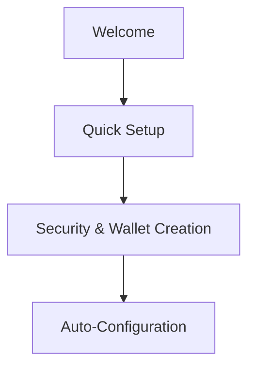
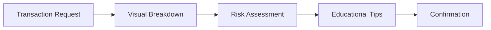
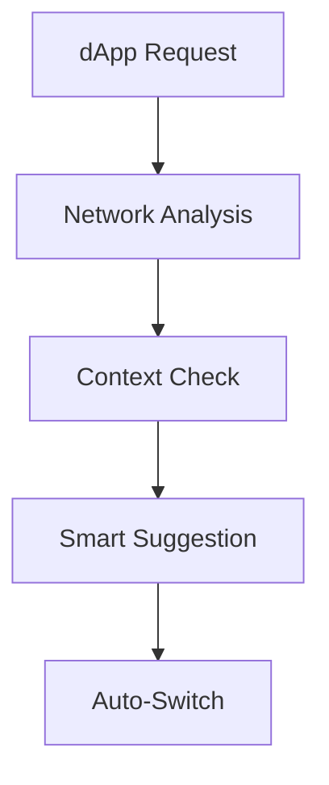
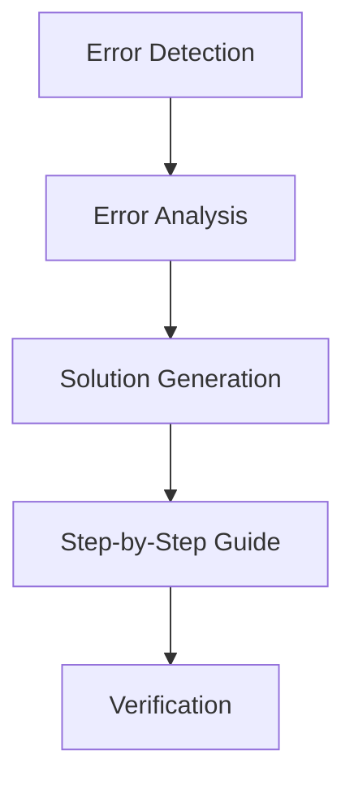
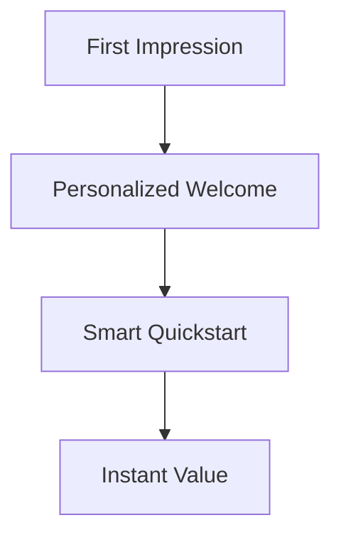
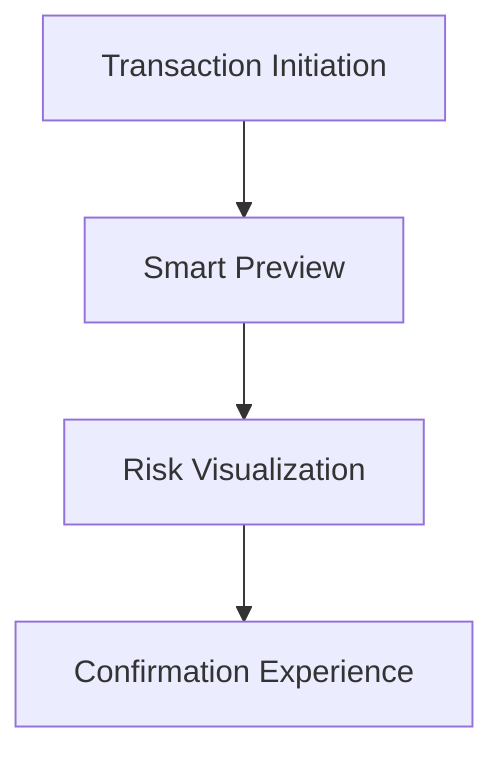
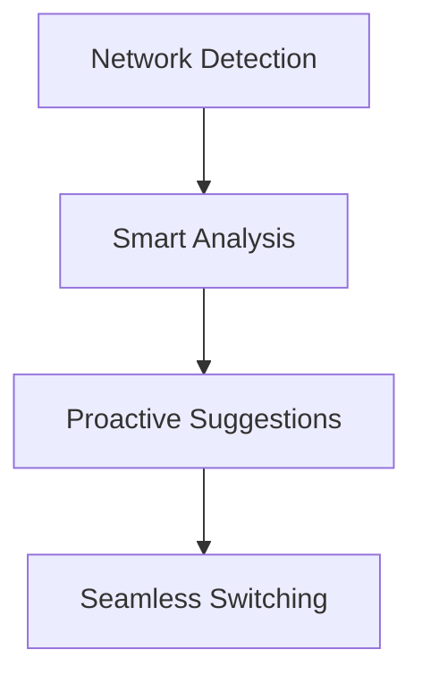
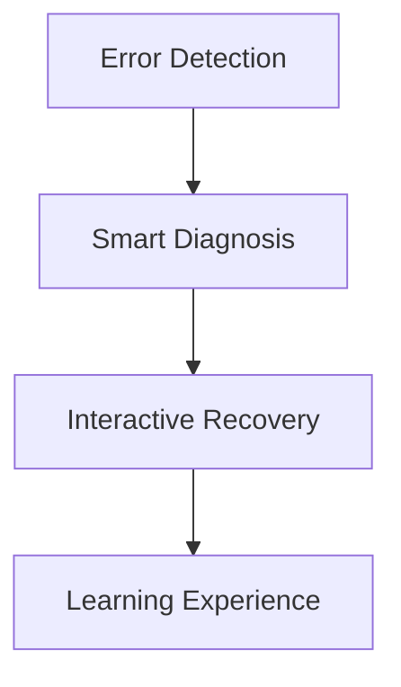
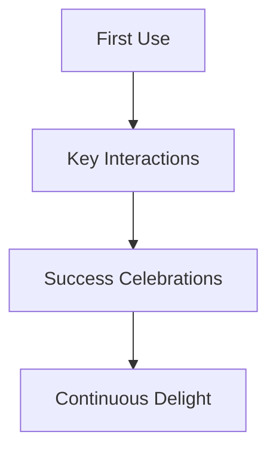

# FreoBus Extension - UX Enhancements

## Onboarding Flow Optimization

### Current Flow (4 Steps)
1. Welcome Screen
2. Security Setup
3. Wallet Creation/Import
4. Network Configuration

### Optimized Flow (2 Steps)

### Implementation Details
1. **Combined Welcome & Setup**
   - Single-page welcome with immediate action
   - Smart defaults for security settings
   - Progress indicator showing 2 steps

2. **Auto-Configuration**
   - Network detection based on user's location
   - Default account setup with suggested name
   - Automatic permission configuration

3. **Smart Defaults**
   - Pre-selected security options
   - Suggested network based on usage patterns
   - Auto-generated account names

## Transaction Signing UX

### Enhanced Transaction Screen

### Key Features
1. **Visual Transaction Breakdown**
   - Gas fee visualization
   - Token transfer preview
   - Network impact indicator

2. **Educational Elements**
   - Contextual tooltips
   - Risk level indicators
   - Common scam warnings

3. **Confirmation Flow**
   - Two-step verification
   - Transaction summary
   - Estimated completion time

## Network Auto-Detection

### Smart Network Selection

### Implementation
1. **Context Analysis**
   - dApp requirements
   - User preferences
   - Network congestion
   - Gas prices

2. **Smart Suggestions**
   - Cost-effective alternatives
   - Performance recommendations
   - Security considerations

3. **Auto-Switch Logic**
   - Gas price thresholds
   - Network stability
   - User permission levels

## Error Recovery System

### Guided Recovery Flow

### Common Scenarios
1. **Transaction Failures**
   - Insufficient gas
   - Network congestion
   - Invalid parameters

2. **Connection Issues**
   - Network switching
   - RPC endpoint failures
   - Session timeouts

3. **Security Errors**
   - Permission denials
   - Signature failures
   - Authentication issues

### Recovery Features
1. **Smart Diagnosis**
   - Error pattern recognition
   - Context-aware solutions
   - Historical resolution data

2. **Step-by-Step Guides**
   - Visual instructions
   - Interactive troubleshooting
   - Progress tracking

3. **Preventive Measures**
   - Early warning system
   - Proactive suggestions
   - Best practices tips

## Implementation Timeline

### Phase 1: Core Enhancements
- [ ] Onboarding optimization
- [ ] Basic transaction UI
- [ ] Network detection
- [ ] Error handling

### Phase 2: Advanced Features
- [ ] Smart defaults
- [ ] Educational content
- [ ] Context analysis
- [ ] Recovery guides

### Phase 3: Polish & Refinement
- [ ] UI/UX refinement
- [ ] Performance optimization
- [ ] User testing
- [ ] Feedback integration

## Success Metrics

### Quantitative
- 50% reduction in onboarding time
- 30% decrease in failed transactions
- 40% improvement in error recovery
- 25% increase in user retention

### Qualitative
- User satisfaction scores
- Support ticket reduction
- Positive feedback metrics
- Feature adoption rates

## User Testing Plan

### Phase 1: Internal Testing
- Developer testing
- QA validation
- Security review

### Phase 2: Beta Testing
- Limited user group
- Feedback collection
- Issue tracking

### Phase 3: Public Release
- Gradual rollout
- Monitoring
- Continuous improvement

## UX Expert Analysis & Recommendations

### 1. Onboarding Experience Enhancement

#### Critical Improvements
1. **Personalized First Touch**
   - Dynamic welcome message based on user's crypto experience level
   - Visual progress indicator with gamification elements
   - Quick-start options: "I'm New" vs "I'm Experienced"

2. **Instant Value Proposition**
   - Show immediate benefits (e.g., "Connect to 3 dApps in 30 seconds")
   - Visual demonstration of key features
   - Success celebration after first action

3. **Smart Defaults Enhancement**
   - Location-based network suggestions
   - Timezone-aware gas price settings
   - Device-specific security recommendations

### 2. Transaction Experience Revolution

#### Game-Changing Features
1. **Smart Transaction Preview**
   - 3D visualization of token transfers
   - Animated gas fee breakdown
   - Real-time network status indicators

2. **Risk Assessment UI**
   - Color-coded risk levels with animations
   - Historical transaction comparison
   - Smart contract interaction preview

3. **Enhanced Confirmation**
   - Biometric authentication integration
   - Transaction success probability indicator
   - Post-transaction celebration animation

### 3. Network Intelligence

#### Advanced Features
1. **Proactive Network Management**
   - Predictive network switching
   - Gas price trend visualization
   - Network health dashboard

2. **Smart Suggestions**
   - Cost-saving recommendations
   - Performance optimization tips
   - Security enhancement alerts

3. **Seamless Experience**
   - Background network optimization
   - Automatic failover handling
   - Performance monitoring

### 4. Error Recovery Revolution

#### Innovative Solutions
1. **Smart Error Handling**
   - AI-powered error diagnosis
   - Contextual recovery suggestions
   - Automated fix attempts

2. **Interactive Recovery**
   - Step-by-step visual guides
   - In-app video tutorials
   - Community solution integration

3. **Learning System**
   - Error prevention tips
   - Best practices education
   - User behavior analysis

### 5. "Wow Effect" Moments

#### Implementation Strategy
1. **First-Time User Experience**
   - Welcome animation sequence
   - Quick-win achievement system
   - Personalized onboarding tour

2. **Key Interaction Points**
   - Transaction success celebrations
   - Network switch confirmations
   - Security achievement unlocks

3. **Continuous Engagement**
   - Progress tracking system
   - Feature discovery prompts
   - User milestone celebrations

### 6. Success Metrics Enhancement

#### Quantitative Goals
- 75% reduction in onboarding time (from current 50%)
- 90% first-time success rate
- 60% decrease in support tickets
- 40% increase in feature adoption

#### Qualitative Goals
- "Delighted" user feedback
- Viral sharing potential
- Industry recognition
- Community engagement

### 7. Implementation Priority

#### Phase 1: Foundation (2 weeks)
- [ ] Personalized onboarding flow
- [ ] Basic transaction visualization
- [ ] Smart error handling

#### Phase 2: Enhancement (3 weeks)
- [ ] Advanced network intelligence
- [ ] Interactive recovery system
- [ ] Success celebration system

#### Phase 3: Polish (2 weeks)
- [ ] Animation and micro-interactions
- [ ] Performance optimization
- [ ] User testing and refinement

### 8. Key Differentiators
1. **Emotional Connection**
   - Celebratory moments
   - Progress visualization
   - Achievement system

2. **Intelligent Assistance**
   - Proactive suggestions
   - Context-aware help
   - Smart defaults

3. **Seamless Experience**
   - Zero-friction interactions
   - Instant feedback
   - Smooth transitions 